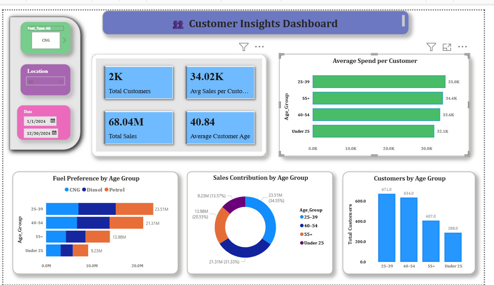
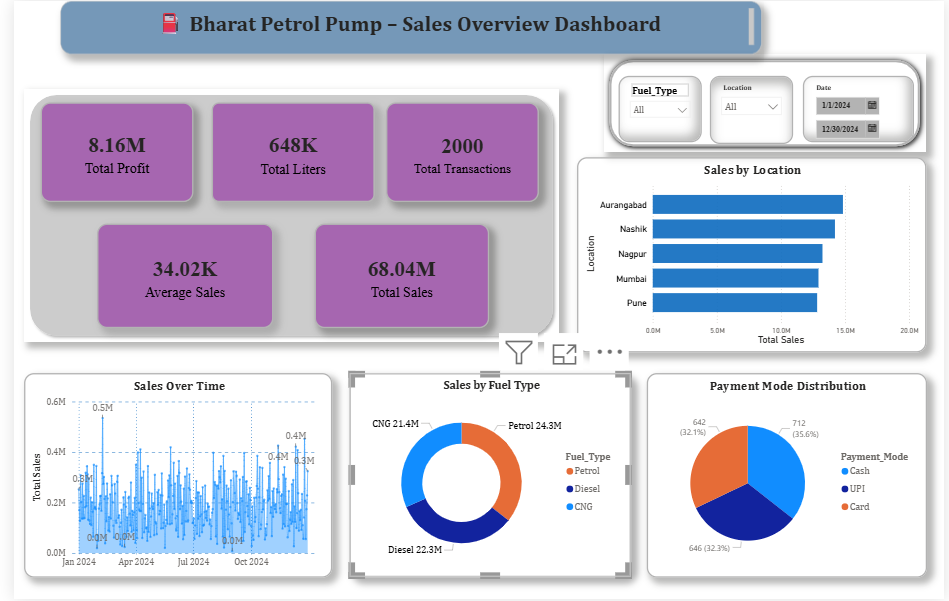
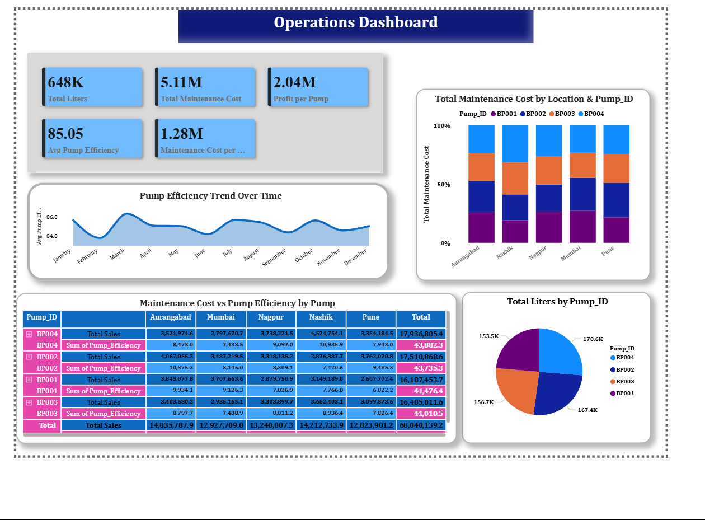

# Day5_Bharat_Fuel_Petrol_Sales_Analysis_Dashboard ⛽📊

An interactive Power BI dashboard project created to analyze petrol pump sales, revenue, fuel performance, customer behavior, and  business KPIs.

---

## 📌 Project Overwiev 

This project is part of my **31 Days Data Analytics Challenge**.

The Bharat Petrol Pump Sales Dashboard helps visualize and analyze sales performance using Power BI.  
It provides useful business insights through KPI cards, charts, slicers, and   interactive visual. 

---

## 🎯 Objective

The main objective of this project is to:

- Analyze petrol pump sales data
- Track total revenue and transactions
- Understand fuel-wise sales performance
- Identify monthly and daily sales trends
- Create an interactive dashboard for business decision Making 

---

## 🛠️ Tools & Technologies Used 

- Power BI
- Power Query
- Dax
- CSV Dataset
- Data Cleaning
- Data Visualization
- Business Analytics
- Git
- GitHub

---

## 📂 Project Folder Structure

```txt
bharat-petrol-pump-dashboard/
│
├── data/
│   └── Bharat_Petrol_Pump_Data.csv
│
├── dashboard/
│   └── bharat-petrolpump.pbix
│
├── screenshots/
│   ├── dashboard-overview.png
│   ├── kpi-cards.png
│   ├── sales-analysis.png
│   ├── fuel-analysis.png
│   └── customer-insights.png
│
├── dax-measures/
│   └── dax-formulas.txt
│
├── docs/
│   └── project-report.md
│
├── README.md
├── LICENSE
└── .gitignore
````

---

## 📊 Dashboard Features

* Total Sales Analysis
* Revenue Tracking
* Fuel Type Performance
* Monthly Sales Trends
* Customer Insights
* Transaction Analysis
* Interactive Filters and Slicers
* KPI Cards

---

## 📌 Key KPIs

* Total Sales
* Total Revenue
* Total Liters Sold
* Total Transactions
* Average Sales
* Fuel-wise Sales

---

## 🧮 DAX Measures Used

```DAX
Total Sales = SUM(Bharat_Petrol[Sales_Amount])

Total Liters Sold = SUM(Bharat_Petrol[Liters_Sold])

Average Sales = AVERAGE(Bharat_Petrol[Sales_Amount])

Total Transactions = COUNTROWS(Bharat_Petrol)
```

---

## 🧹 Data Cleaning

Data cleaning and transformation were performed inside Power BI using Power Query.

Steps included:

* Removed null values
* Corrected data types
* Removed duplicate records
* Formatted date columns
* Standardized categorical values

---

## 🖼️ Dashboard Screenshots

### Customer Insights



---

### Sales Analysis



---

### Fuel Analysis



---

## 📈 Key Insights

* Petrol generated strong sales performance.
* Monthly sales trends helped identify revenue patterns.
* Fuel-wise analysis helped compare product performance.
* Customer and transaction analysis helped understand business behavior.
* KPI cards made performance tracking simple and effective.

---

## ✅ Project Learnings

Through this project, I improved my skills in:

* Power BI dashboard creation
* DAX measure writing
* Power Query data transformation
* KPI analysis
* Dashboard storytelling
* Business data visualization
* GitHub project documentation

---

## 🚀 Future Improvements

* Add real-time data connection
* Add sales forecasting
* Improve dashboard UI design
* Add advanced DAX measures
* Add drill-through pages

---

## 👩‍💻 Author

**Gc**
Aspiring Data Analyst & SQlDeveloper

---

## ⭐ Support

If you like this  project, feel free to star this repository.

````

For `.gitignore`:

```txt
.DS_Store
Thumbs.db
````

For `dax-formulas.txt`:

```txt
Total Sales = SUM(Bharat_Petrol[Sales_Amount])

Total Liters Sold = SUM(Bharat_Petrol[Liters_Sold])

Average Sales = AVERAGE(Bharat_Petrol[Sales_Amount])

Total Transactions = COUNTROWS(Bharat_Petrol)
```
